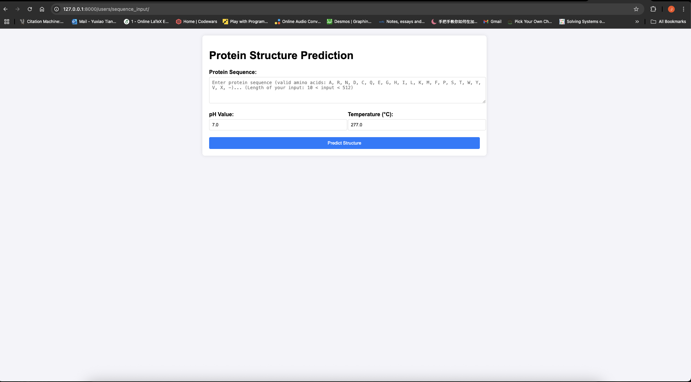
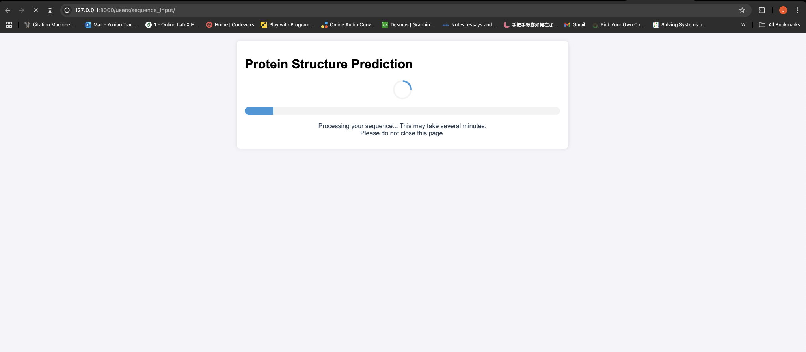
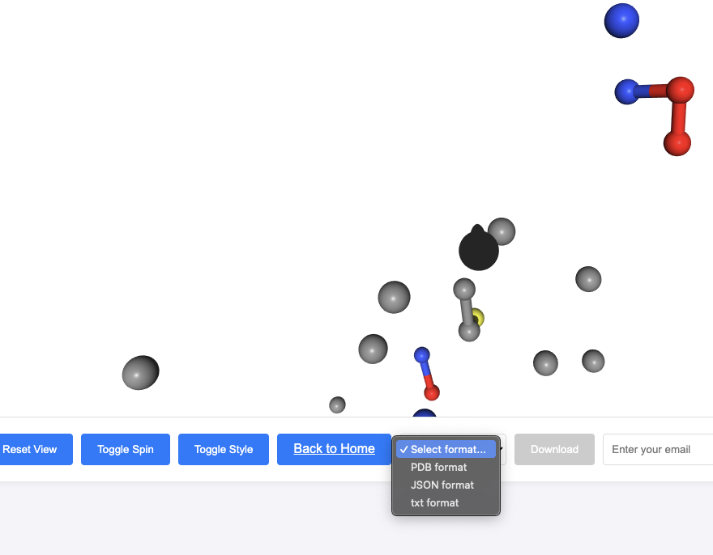

# Capstone Project
## Overview

This project aims to predict 3D protein structures from amino acid sequences. It leverages deep learning techniques and incorporates the principles of Evoformer from AlphaFold3 to generate accurate protein predictions. The model takes into account pH and temperature as additional inputs, allowing for more nuanced results.

## Features

**Protein Structure Prediction**: Predicts 3D coordinates of proteins based on amino acid sequences, pH and temperature.

**User Interface**: A Django-based web application where users can input amino acid sequences, pH, and temperature, and visualize protein structure in 3D space directly. In addition, protein structure is also available for download to local.

**3D Visualization**: Displays predicted 3D protein structures.

**Integration with HH-suite**: Uses HHBlits for multiple sequence alignment, HHBlits is deployed on server so user no need to download it manually.

## Installation
Clone the repository:

    git clone https://github.com/XxTxXTxX/CapstoneProject.git
    
Install the dependencies:

    pip install -r requirements.txt
    
Set up your environment variables in a .env file:

    SSH_HOST=34.44.84.176
    SSH_USER=msa_user
    SSH_KEY_PATH=<path-to-your-ssh-key>
    REMOTE_DIR=/home/jameslikelywood/hh-suite/tmp
    DATABASE_PATH=/home/jameslikelywood/hh-suite/database/uniclust30_2018_08/uniclust30_2018_08

SSH_KEY_PATH GUIDE:

    SSH_KEY_PATH= # */test.pem
    # Example 
    SSH_KEY_PATH=/Users/hahayes/Desktop/Capstone/model/test.pem

Where test.pem is the essencial SSH key for connecting to our server (When we do Mulitple Sequence Alignment(MSA) search, the program need to access database on the server to get MSA sequence), Please contact me through Email: tiany58@mcmaster.ca / Jameslikelywood@gmail.com, and I will send you **.pem key** directly.

After receive **.pem key**, you will need to set **SSH_KEY_PATH** to the place where you store **.pem key**.

## Usage
After setting up all environment, open terminal:

    hahayes@Yuxiaos-MacBook-Air Capstone % cd src
    hahayes@Yuxiaos-MacBook-Air src % cd mysite
    hahayes@Yuxiaos-MacBook-Air mysite % python3 manage.py runserver
    
    Watching for file changes with StatReloader
    Performing system checks...
    Using device: cpu
    System check identified no issues (0 silenced).
    April 07, 2025 - 22:55:56
    Django version 5.1.5, using settings 'mysite.settings'
    Starting development server at http://127.0.0.1:8000/
    Quit the server with CONTROL-C.

Then, once the local server successfully run, navigate to http://127.0.0.1:8000/users/sequence_input/ in your browser to start interacting with the app.

Input your protein sequence, pH, and temperature, then click **Predict Structure**

It may take up to 5 - 6 minutes to generate result. Once the result is out, you will be redirect to result page and able to visualize protein structure in 3D space. In addition, you can choose different format to download protein structure, which records all the ATOM types and corresponding coordinates (PDB format is recommended).  

After downloading the result, use terminal to check ATOM types and coordinates:

    hahayes@Yuxiaos-MacBook-Air Capstone % cat temp_structure.pdb 
    ATOM      1  N    ASN A    1      19.561  15.394  21.466  1.00  0.00           N
    ATOM      2  CA   ASN A    1      20.324  16.255  20.568  1.00  0.00           C
    ATOM      3  C    ASN A    1      21.815  16.216  20.888  1.00  0.00           C
    ATOM      4  O    ASN A    1      19.803  17.692  20.632  1.00  0.00           O
    ATOM      5  CB   ASN A    1      22.490  17.247  20.847  1.00  0.00           C
    ATOM      6  CG   ASN A    1      19.366  18.215  19.278  1.00  0.00           C
    ATOM      7  ND2  ASN A    1      18.330  17.607  18.714  1.00  0.00           N
    ATOM      8  OD1  ASN A    1      19.955  19.158  18.743  1.00  0.00           O
    ATOM      9  N    LEU A    2      19.371  16.499  22.774  1.00  0.00           N
    ATOM     10  CA   LEU A    2      20.066  17.214  21.709  1.00  0.00           C
    ATOM     11  C    LEU A    2      21.525  16.781  21.625  1.00  0.00           C
    ATOM     12  O    LEU A    2      19.982  18.726  21.936  1.00  0.00           O
    ATOM     13  CB   LEU A    2      22.409  17.605  21.382  1.00  0.00           C
    ATOM     14  CG   LEU A    2      19.264  19.535  20.855  1.00  0.00           C
    ATOM     15  CD1  LEU A    2      20.238  20.490  20.172  1.00  0.00           C
    ATOM     16  CD2  LEU A    2      18.614  18.606  19.835  1.00  0.00           C
    ATOM     17  N    TYR A    3      22.736  15.642  26.160  1.00  0.00           N
    ATOM     18  CA   TYR A    3      22.745  14.774  24.988  1.00  0.00           C
    ATOM     19  C    TYR A    3      22.472  15.571  23.718  1.00  0.00           C
    ATOM     20  O    TYR A    3      21.708  13.657  25.137  1.00  0.00           O
    ATOM     21  CB   TYR A    3      23.351  15.712  22.865  1.00  0.00           C
    ATOM     22  CG   TYR A    3      21.680  12.696  23.973  1.00  0.00           C
    ATOM     23  CD1  TYR A    3      21.075  13.049  22.768  1.00  0.00           C
    ATOM     24  CD2  TYR A    3      22.256  11.434  24.075  1.00  0.00           C
    ATOM     25  CE1  TYR A    3      21.044  12.166  21.694  1.00  0.00           C
    ATOM     26  CE2  TYR A    3      22.231  10.544  23.007  1.00  0.00           C
    ATOM     27  CZ3  TYR A    3      21.597  10.040  20.762  1.00  0.00           C
    ATOM     28  NZ   TYR A    3      21.624  10.918  21.822  1.00  0.00           N
    ATOM     29  N    GLN A    4      25.544  15.565  24.805  1.00  0.00           N
    ATOM     30  CA   GLN A    4      24.870  16.804  25.181  1.00  0.00           C
    ATOM     31  C    GLN A    4      23.410  16.793  24.737  1.00  0.00           C
    ATOM     32  O    GLN A    4      25.592  18.012  24.581  1.00  0.00           O
    ATOM     33  CB   GLN A    4      22.966  17.695  24.024  1.00  0.00           C
    ATOM     34  CG   GLN A    4      26.959  18.279  25.197  1.00  0.00           C
    ATOM     35  CD   GLN A    4      26.894  18.498  26.697  1.00  0.00           C
    ATOM     36  NE2  GLN A    4      25.798  19.087  27.164  1.00  0.00           N
    ATOM     37  OE1  GLN A    4      27.821  18.140  27.431  1.00  0.00           O
    ATOM     38  N    PHE A    5      21.320  13.516  21.526  1.00  0.00           N
    ATOM     39  CA   PHE A    5      21.828  14.396  20.480  1.00  0.00           C
    ATOM     40  C    PHE A    5      22.833  15.390  21.049  1.00  0.00           C
    ATOM     41  O    PHE A    5      20.677  15.145  19.800  1.00  0.00           O
    ATOM     42  CB   PHE A    5      23.022  16.476  20.496  1.00  0.00           C
    ATOM     43  CG   PHE A    5      20.480  14.773  18.356  1.00  0.00           C
    ATOM     44  CD1  PHE A    5      20.841  15.652  17.342  1.00  0.00           C
    ATOM     45  CD2  PHE A    5      19.934  13.543  18.011  1.00  0.00           C
    ATOM     46  CE1  PHE A    5      20.660  15.310  16.003  1.00  0.00           C
    ATOM     47  CE2  PHE A    5      19.751  13.195  16.676  1.00  0.00           C
    ATOM     48  NZ   PHE A    5      20.114  14.080  15.674  1.00  0.00           N
    ATOM     49  N    LYS A    6      22.130  17.421  24.071  1.00  0.00           N
    ATOM     50  CA   LYS A    6      21.999  15.969  24.150  1.00  0.00           C
    ATOM     51  C    LYS A    6      21.571  15.382  22.808  1.00  0.00           C
    ATOM     52  O    LYS A    6      20.997  15.579  25.237  1.00  0.00           O
    ATOM     53  CB   LYS A    6      21.817  14.206  22.532  1.00  0.00           C
    ATOM     54  CG   LYS A    6      20.010  14.502  24.811  1.00  0.00           C
    ATOM     55  CD   LYS A    6      18.968  15.050  23.843  1.00  0.00           C
    ATOM     56  CE   LYS A    6      18.411  13.957  22.942  1.00  0.00           C
    ATOM     57  TYR_OH LYS A    6      17.218  13.294  23.548  1.00  0.00           T
    ATOM     58  N    ASN A    7      19.980  14.782  20.840  1.00  0.00           N
    ATOM     59  CA   ASN A    7      20.788  15.733  20.083  1.00  0.00           C
    ATOM     60  C    ASN A    7      22.160  15.935  20.720  1.00  0.00           C
    ATOM     61  O    ASN A    7      20.060  17.073  19.955  1.00  0.00           O
    ATOM     62  CB   ASN A    7      22.673  17.055  20.758  1.00  0.00           C
    ATOM     63  CG   ASN A    7      19.858  17.491  18.512  1.00  0.00           C
    ATOM     64  ND2  ASN A    7      19.082  16.709  17.770  1.00  0.00           N
    ATOM     65  OD1  ASN A    7      20.395  18.509  18.066  1.00  0.00           O
    ATOM     66  N    MET A    8      22.587  16.804  23.841  1.00  0.00           N
    ATOM     67  CA   MET A    8      22.121  15.535  24.390  1.00  0.00           C
    ATOM     68  C    MET A    8      21.501  14.665  23.301  1.00  0.00           C
    ATOM     69  O    MET A    8      21.107  15.773  25.510  1.00  0.00           O
    ATOM     70  CB   MET A    8      20.277  14.553  23.213  1.00  0.00           C
    ATOM     71  CG   MET A    8      19.916  14.829  25.469  1.00  0.00           C
    ATOM     72  SD   MET A    8      19.145  14.742  23.807  1.00  0.00           S
    ATOM     73  CE   MET A    8      18.674  12.990  23.763  1.00  0.00           C
    ATOM     74  N    ILE A    9      20.469  14.556  20.693  1.00  0.00           N
    ATOM     75  CA   ILE A    9      21.195  15.529  19.885  1.00  0.00           C
    ATOM     76  C    ILE A    9      22.518  15.879  20.563  1.00  0.00           C
    ATOM     77  O    ILE A    9      20.358  16.807  19.652  1.00  0.00           O
    ATOM     78  CB   ILE A    9      22.944  17.037  20.546  1.00  0.00           C
    ATOM     79  CG1  ILE A    9      20.168  17.054  18.151  1.00  0.00           C
    ATOM     80  CG2  ILE A    9      21.015  18.014  20.327  1.00  0.00           C
    ATOM     81  CD1  ILE A    9      20.839  18.323  17.643  1.00  0.00           C
    ATOM     82  N    LYS A   10      22.112  17.455  24.144  1.00  0.00           N
    ATOM     83  CA   LYS A   10      21.977  16.002  24.203  1.00  0.00           C
    ATOM     84  C    LYS A   10      21.546  15.436  22.853  1.00  0.00           C
    ATOM     85  O    LYS A   10      20.973  15.600  25.284  1.00  0.00           O
    ATOM     86  CB   LYS A   10      21.604  14.223  22.636  1.00  0.00           C
    ATOM     87  CG   LYS A   10      19.985  14.529  24.845  1.00  0.00           C
    ATOM     88  CD   LYS A   10      18.965  15.082  23.857  1.00  0.00           C
    ATOM     89  CE   LYS A   10      18.422  13.991  22.944  1.00  0.00           C
    ATOM     90  TYR_OH LYS A   10      17.217  13.328  23.529  1.00  0.00           T
    ATOM     91  N    CYS A   11      19.251  15.790  21.683  1.00  0.00           N
    ATOM     92  CA   CYS A   11      20.062  16.663  20.841  1.00  0.00           C
    ATOM     93  C    CYS A   11      21.547  16.394  21.048  1.00  0.00           C
    ATOM     94  O    CYS A   11      19.753  18.130  21.136  1.00  0.00           O
    ATOM     95  CB   CYS A   11      22.344  17.329  21.142  1.00  0.00           C
    ATOM     96  SG   CYS A   11      19.152  19.050  19.703  1.00  0.00           S
    ATOM     97  N    THR A   12      18.940  16.080  22.197  1.00  0.00           N
    ATOM     98  CA   THR A   12      19.806  16.907  21.365  1.00  0.00           C
    ATOM     99  C    THR A   12      21.253  16.427  21.445  1.00  0.00           C
    ATOM    100  O    THR A   12      19.730  18.388  21.778  1.00  0.00           O
    ATOM    101  CB   THR A   12      22.174  17.236  21.573  1.00  0.00           C
    ATOM    102  CG2  THR A   12      21.092  18.903  22.234  1.00  0.00           C
    ATOM    103  OG1  THR A   12      19.286  19.168  20.661  1.00  0.00           O
    ATOM    104  N    VAL A   13      22.584  17.313  25.109  1.00  0.00           N
    ATOM    105  CA   VAL A   13      22.514  15.928  24.656  1.00  0.00           C
    ATOM    106  C    VAL A   13      22.035  15.881  23.207  1.00  0.00           C
    ATOM    107  O    VAL A   13      21.581  15.084  25.553  1.00  0.00           O
    ATOM    108  CB   VAL A   13      22.823  15.622  22.294  1.00  0.00           C
    ATOM    109  CG1  VAL A   13      20.661  14.209  24.703  1.00  0.00           C
    ATOM    110  CG2  VAL A   13      22.400  14.226  26.515  1.00  0.00           C
    ATOM    111  N    PRO A   14      18.785  16.374  22.744  1.00  0.00           N
    ATOM    112  CA   PRO A   14      19.669  17.145  21.866  1.00  0.00           C
    ATOM    113  C    PRO A   14      21.074  16.554  21.779  1.00  0.00           C
    ATOM    114  O    PRO A   14      19.698  18.528  22.521  1.00  0.00           O
    ATOM    115  CB   PRO A   14      22.062  17.291  21.830  1.00  0.00           C
    ATOM    116  CG   PRO A   14      19.113  19.447  21.499  1.00  0.00           C
    ATOM    117  CD   PRO A   14      20.155  20.458  21.113  1.00  0.00           C
    ATOM    118  N    SER A   15      19.892  14.926  21.509  1.00  0.00           N
    ATOM    119  CA   SER A   15      20.463  15.731  20.435  1.00  0.00           C
    ATOM    120  C    SER A   15      21.921  16.078  20.718  1.00  0.00           C
    ATOM    121  O    SER A   15      19.654  17.014  20.238  1.00  0.00           O
    ATOM    122  CB   SER A   15      22.394  17.152  20.339  1.00  0.00           C
    ATOM    123  OG   SER A   15      19.078  17.052  18.944  1.00  0.00           O
    ATOM    124  N    ARG A   16      22.216  17.378  24.380  1.00  0.00           N
    ATOM    125  CA   ARG A   16      22.128  15.927  24.253  1.00  0.00           C
    ATOM    126  C    ARG A   16      21.694  15.526  22.847  1.00  0.00           C
    ATOM    127  O    ARG A   16      21.154  15.355  25.285  1.00  0.00           O
    ATOM    128  CB   ARG A   16      22.471  14.929  22.099  1.00  0.00           C
    ATOM    129  CG   ARG A   16      20.203  14.311  24.722  1.00  0.00           C
    ATOM    130  CD   ARG A   16      19.024  14.952  24.003  1.00  0.00           C
    ATOM    131  NE   ARG A   16      18.423  14.039  23.035  1.00  0.00           N
    ATOM    132  CZ   ARG A   16      16.925  13.111  24.528  1.00  0.00           C
    ATOM    133  CZ2  ARG A   16      16.967  12.401  22.348  1.00  0.00           C
    ATOM    134  NZ   ARG A   16      17.440  13.186  23.306  1.00  0.00           N
    ATOM    135  N    SER A   17      19.456  15.312  21.133  1.00  0.00           N
    ATOM    136  CA   SER A   17      20.283  16.226  20.352  1.00  0.00           C
    ATOM    137  C    SER A   17      21.751  16.119  20.748  1.00  0.00           C
    ATOM    138  O    SER A   17      19.802  17.667  20.527  1.00  0.00           O
    ATOM    139  CB   SER A   17      22.440  17.133  20.880  1.00  0.00           C
    ATOM    140  OG   SER A   17      19.470  18.242  19.275  1.00  0.00           O
    ATOM    141  N    TRP A   18      22.373  17.145  25.218  1.00  0.00           N
    ATOM    142  CA   TRP A   18      22.134  15.746  24.879  1.00  0.00           C
    ATOM    143  C    TRP A   18      21.575  15.616  23.466  1.00  0.00           C
    ATOM    144  O    TRP A   18      21.172  15.106  25.883  1.00  0.00           O
    ATOM    145  CB   TRP A   18      22.119  14.879  22.641  1.00  0.00           C

License

This project is licensed under the MIT License.

