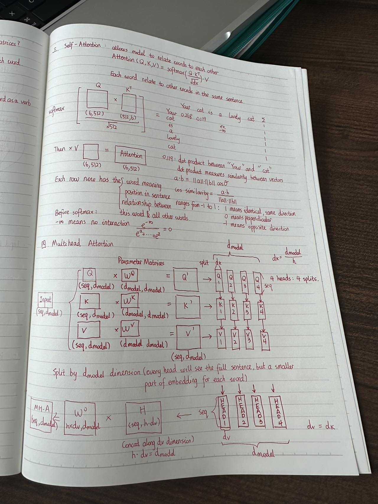
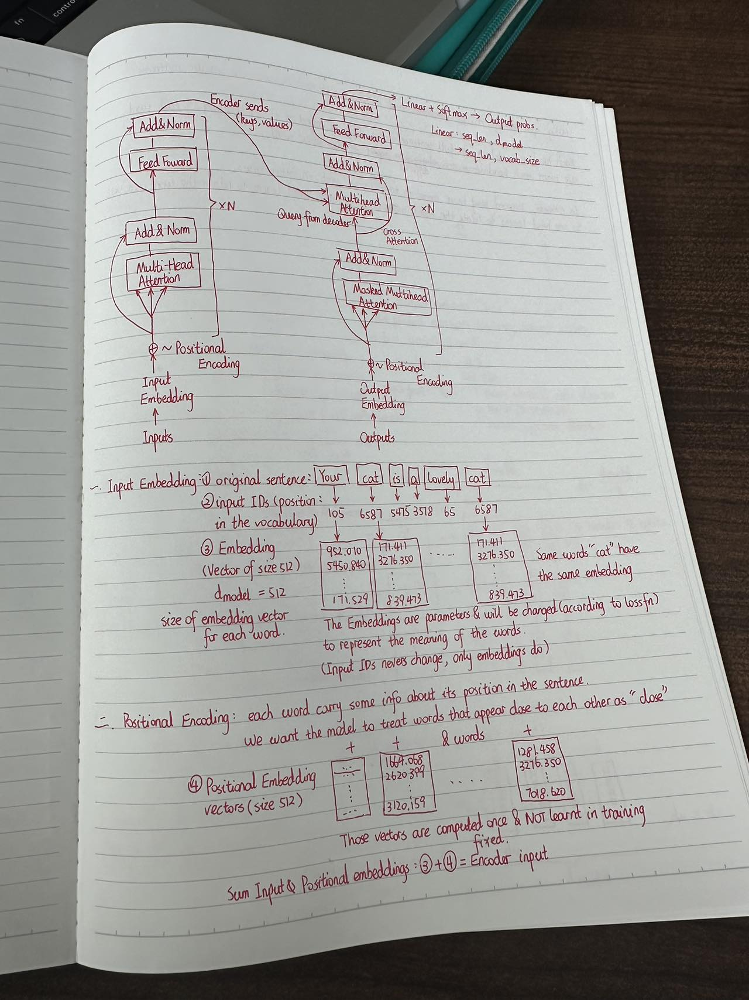

Meeting on 2024/10/7

Attended: Xinyao Yin, Yuxiao Tian

About:

Basically we went over through the SRS sample document from last year, understood what we need in our SRS document.

Also we discussed about the concepts and fundamental idea of how Transformer work, because what we are doing in this project is a brand new concept and there is no libraries for us to use, so we 
    need to scratch everything by ourself.
    

Here are some Notes from Yin that can be used to learn how transformer works:

